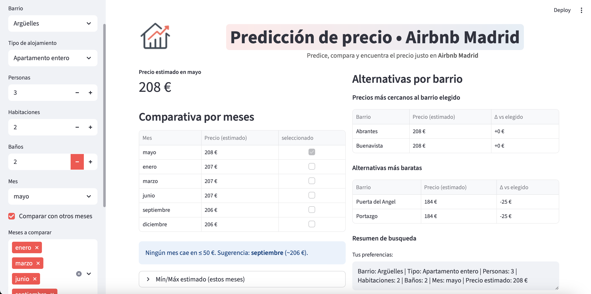
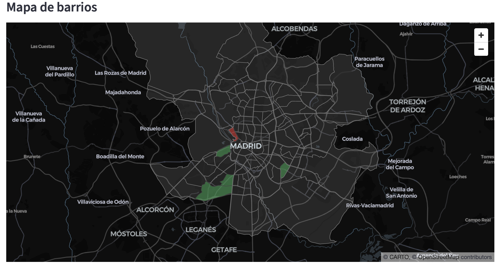

# 🏠 Predicción de precios en Airbnb Madrid

 
 
 

Este proyecto corresponde al Trabajo Fin de Máster (TFM) en **Data Science**, cuyo objetivo fue desarrollar un modelo de *Machine Learning* capaz de predecir los precios de alojamientos de **Airbnb en Madrid**, incorporando factores espaciales, estructurales y de estacionalidad temporal.  

El resultado final es un sistema de predicción implementado en **Python** y desplegado en una interfaz interactiva que permite a los usuarios estimar el precio esperado según características específicas (barrio, tipo de alojamiento, número de habitaciones, baños, etc.) y comparar alternativas.

---

## 📊 Objetivos del proyecto
- Analizar el mercado de Airbnb en Madrid utilizando datos abiertos de [Inside Airbnb](http://insideairbnb.com/).
- Limpiar y preparar los datos eliminando outliers y normalizando variables.
- Comparar diferentes modelos predictivos (**CatBoost, XGBoost, Random Forest**).
- Seleccionar el modelo con mejor rendimiento y explicabilidad.
- Desarrollar una **interfaz amigable** para facilitar la interacción con el modelo.

---

## ⚙️ Metodología
El proyecto se desarrolló siguiendo la metodología **CRISP-DM**, con las fases de:
1. Comprensión del problema.  
2. Obtención y limpieza de datos.  
3. Análisis exploratorio (EDA).  
4. Modelado y evaluación comparativa.  
5. Selección del modelo óptimo.  
6. Desarrollo de la aplicación interactiva.  

---

## 🛠️ Tecnologías empleadas
- **Lenguaje**: Python 3.13.2  
- **Entorno**: Jupyter Notebook  
- **Librerías principales**:
  - pandas, NumPy → análisis y manipulación de datos  
  - matplotlib, seaborn, plotly → visualización de datos  
  - scikit-learn → preprocesamiento, métricas y modelado  
  - xgboost, catboost → gradient boosting  
  - streamlit → creación de la aplicación interactiva  

---

## 📈 Resultados principales  

- **Modelo seleccionado**: Random Forest (optimizado con búsqueda de hiperparámetros)  
- **Métricas obtenidas (conjunto de prueba)**:  
  - **MAE:** 6,34 €  
  - **RMSE:** 8,75 €  
  - **R²:** 0,975  

El modelo optimizado ofrece un rendimiento sobresaliente, con errores de predicción muy bajos y una capacidad de explicación superior al **97% de la variabilidad de los precios**.  

### 🔎 Aplicabilidad práctica  
Este sistema puede apoyar a distintos actores del mercado turístico:  
- **Anfitriones:** para fijar precios competitivos y maximizar ingresos.  
- **Turistas:** para identificar estancias con tarifas justas.  
- **Inversores:** para evaluar oportunidades de rentabilidad en diferentes barrios.  

---

## 🖥️ Interfaz de usuario
La aplicación desarrollada en **Streamlit** permite:  
- Estimar el precio esperado en función de barrio, tipo de alojamiento, habitaciones, baños y mes.  
- Comparar precios entre diferentes meses.  
- Visualizar barrios con precios más cercanos o más baratos que el seleccionado.  
- Explorar un mapa interactivo con la distribución espacial de precios.

### 🖼️ Interfaz principal

### 🗺️ Mapa de barrios
 

---

## 📂 Estructura del repositorio

- datos_brutos/               → Datasets originales (Inside Airbnb)
- notebooks/                  → Notebooks de limpieza, análisis y modelado
- mi_app_airbnb/              → Archivos para la app en Streamlit
- 01_TFM_Airbnb_Madrid_anteproyecto.pdf
- 02_TFM_Airbnb_Madrid_diapositivas.pdf
- 03_TFM_Airbnb_Madrid_memorias.pdf
- README.md                   

---

## 👩‍💻 Autora
**Katherine López Ramírez**  
Máster en Data Science – Universidad Europea de Madrid  

---

## 🔗 Enlaces
- 📚 Datos:: [Inside Airbnb](http://insideairbnb.com/get-the-data/)  
- 🌍 Proyecto completo en GitHub: *([este mismo repositorio](https://github.com/kathe-Lopez/TFM-Airbnb-Madrid))*  

---

## 📌 Palabras clave
*Machine Learning, Airbnb, Predicción de precios, Random Forest, Data Science, Streamlit*

## 📜 Licencia
Este proyecto está bajo la licencia [MIT](./LICENSE).  
Puedes usarlo, modificarlo y distribuirlo libremente, siempre que se mantenga el aviso de copyright.
